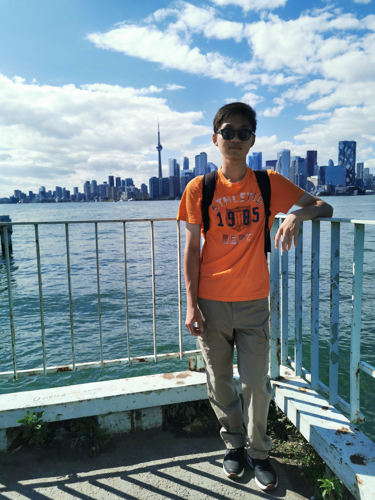

## About me

[{:align="right" width="20%"}](./img/img2.jpg)
My name is Yuntao (Winston) Wu. I am currently a MASc student in Computer Engineering at University of Toronto, working as a research assistant at [Rotman FinHub](https://www.rotman.utoronto.ca/FacultyAndResearch/ResearchCentres/FinHub){:target="_blank"}. I graduated from University of British Columbia with a BASc in Computer Engineering, minor in Honors Mathematics.
 

My [<i class="fa-brands fa-github"></i> Github](https://github.com/yuntaowu2000){:target="_blank"}, [<i class="fa-brands fa-linkedin"></i> LinkedIn](https://www.linkedin.com/in/yuntaowu936a3b179/?locale=en_US){:target="_blank"}.

### <i class="fa-solid fa-graduation-cap"></i> Education 
- MASc in Computer Engineering, University of Toronto (Expected 2024)
  - GPA: 4.0/4.0
- BASc in Computer Engineering, minor in Honors Mathematics, University of British Columbia (2022)
  - GPA: 91.8/100

#### <i class="fa-solid fa-award"></i> Main Scholarships & Awards
- University of Toronto
  - Ontario Graduate Scholarship (2023)
  - Queen Elizabeth II Graduate Scholarship in Science & Technology (2022)
  - Edward S. Rogers Sr. Graduate Scholarships (2022)
- University of British Columbia
  - Trek Excellence Scholarship (2019W-2021W)
  - Dean's Distinct (2021W)
    - Dean's Honor list (2018W-2021W)
  - Pat and Betty Love Scholarship in Applied Science (2021W)
  - Martin Sikes Memorial Scholarship in Electrical and Computer Engineering (2020W)
  - EXPO 86 Scholarship (2019W)
  - PMC-Sierra Founders Award in Electrical and Computer Engineering (2019W)

#### <i class="fa-solid fa-book"></i> Courses taken with notes & projects (selected)

    
University of Toronto

<ul>
<li>CSC 2125 Blockchain Technology (A+) <a href="notes/CSC2125_Project_Report.pdf" target="_blank">[Course project]</a></li>
<li>CSC 2511 Natural Language Computing (A+) <a href="https://www.cs.toronto.edu/~raeidsaqur/csc401/" target="_blank">[Course website]</a></li>
<li>ECE 1505 Convex Optimization (A) <a href="notes/ECE1505.pdf" target="_blank">[Notes]</a></li>
<li>ECE 1657 Game Theory and Evolutionary Games (A+) <a href="notes/ECE1657.pdf" target="_blank">[Notes]</a> <a href="https://github.com/yuntaowu2000/RL-training" target="_blank">[Course project]</a></li>
<li>ECE 1762 Algorithms and Data Structures (A+) <a href="notes/ECE1762.pdf" target="_blank">[Notes]</a></li>
</ul>

    
University of British Columbia

<i class="fa fa-warning"></i> <strong>Note: </strong>The format of notes may vary from year to year as I organized them. Not all courses/notes I have taken are included here. The course contents might have changed from the year I took them.

 

<ul>
<li><strong>ECE/CS:</strong>
<ul>
  <li>ELEC 201 Circuit Analysis I (A+) <a href="notes/ELEC201.pdf" target="_blank">[Notes]</a></li>
  <li>CPEN 221 Principles of Software Construction (A) <a href="notes/CPEN221.pdf" target="_blank">[Notes]</a></li>
  <li>CPSC 221 Basic Algorithms and Data Structures (A+) <a href="notes/CPSC221.pdf" target="_blank">[Notes]</a></li>
  <li>CPSC 261 Basics of Computer Systems (A+) <a href="notes/CPSC261.pdf" target="_blank">[Notes]</a></li>
  <li>CPEN 321 Software Engineering (A) <a href="https://github.com/yuntaowu2000/CPEN321-Quizzical" target="_blank">[Course Project]</a></li>
  <li>CPEN 331 Operating System (A+)
    <ul>
      <li>OS161</li>
      <li><a href="https://people.ece.ubc.ca/~os161/class-site/calendar.html" target="_blank">[Course website]</a></li>
    </ul>
  </li>
  <li>CPSC 314 Computer Graphics (A+) <a href="notes/CPSC314.pdf" target="_blank">[Notes]</a></li>
  <li>ELEC 331 Computer Communications (A+) <a href="notes/ELEC331.pdf" target="_blank">[Notes]</a></li>
  <li>CPEN 400D Deep Learning (A+)
    <ul>
      <li>Deep Neural Networks, CNN, RNN, NLP using TensorFlow.</li>
      <li><a href="notes/CPEN400D.pdf" target="_blank">[Notes]</a></li>
    </ul>
  </li>
  <li>CPEN 400P Program Analysis (A+)
    <ul>
      <li>Static & dynamic anlysis of programs.</li>
      <li>LLVM, KLEE, AFL.</li>
      <li><a href="https://github.com/ubc-cpen400p-21w/classroom" target="_blank">[Assignments (no solution)]</a></li>
    </ul>
  </li>
  <li>CPSC 425 Computer Vision (A+)
    <ul>
      <li>Image filtering, sampling, classification.</li>
      <li>Object/edge detection. Object recognition.</li>
      <li><a href="notes/CPSC425.pdf" target="_blank">[Notes]</a></li>
    </ul>
  </li>
  <li>ELEC 400M Machine Learning (A+)
    <ul>
      <li>Regression, SVM, Decision Trees, PCA, Deep Learning and CNN using PyTorch.</li>
      <li><a href="https://github.com/yuntaowu2000/400m-final-project" target="_blank">[Final project]</a></li>
    </ul>
  </li>
  <li>EECE 571S Introduction to Quantum Computing (A+)
    <ul>
      <li>Graduate level course taken as an undergraduate student.</li>
      <li>Fundamentals of quantum computing & quantum algorithms.</li>
      <li>Deutsch's problem, QFT, Phase Estimation, Grover's algorithm.</li>
      <li>Error correction.</li>
      <li><a href="notes/EECE571S.pdf" target="_blank">[Notes]</a></li>
    </ul>
  </li>
</ul>
</li>
<li><strong>MATH:</strong>
<ul>
  <li> Calculus
    <ul>
      <li>MATH 100: Differential Calculus (A+)</li>
      <li>MATH 121: Honours Integral Calculus (A+)</li>
      <li>MATH 253: Multivariable Calculus (A+)</li>
      <li>MATH 317: Calculus IV (Vector) (A+)</li>
      <li><a href="notes/MATH-Calculus.pdf" target="_blank">[Notes]</a></li>
    </ul>
  </li>
  <li>MATH 152 Linear Systems (A+) <a href="notes/MATH152.pdf" target="_blank">[Notes]</a></li>
  <li>MATH 220 Mathematical Proof (A+) <a href="notes/MATH220.pdf" target="_blank">[Notes]</a></li>
  <li>MATH 300/301 Complex Variables and Applied Analysis (A+)
    <ul>
      <li>Calculus of Complex variables, Residue Calculus.</li>
      <li>Conformal mapping, Asymptotic Evaluation of Integrals.</li>
      <li><a href="notes/MATH300-301.pdf" target="_blank">[Notes]</a></li>
    </ul>
  </li>
  <li>MATH 316 Elementary Differential Equations II (PDEs) (A+) <a href="notes/MATH316.pdf" target="_blank">[Notes]</a></li>
  <li>MATH 318 Introduction to Probability (A+) <a href="notes/MATH318.pdf" target="_blank">[Notes]</a></li>
  <li>MATH 340 Introduction to Linear Programming (A+) <a href="notes/MATH340.pdf" target="_blank">[Notes]</a></li>
  <li>MATH 345 Applied Nonlinear Dynamics and Chaos (A+) <a href="notes/MATH345.pdf" target="_blank">[Notes]</a></li>
  <li>MATH 424 Classical Differential Geometry (A) <a href="notes/MATH424.pdf" target="_blank">[Notes]</a></li>
</ul>
</li>
<li><strong>PHYS:</strong>
<ul>
  <li> First Year
    <ul>
      <li>PHYS 157: Introductory Physics for Engineers I (Thermodynamics & Waves) (A+)</li>
      <li>PHYS 158: Introductory Physics for Engineers II (Electricity & magnetism) (A+)</li>
      <li>PHYS 170: Mechanics (A+)</li>
      <li><a href="notes/PHYS-firstyear.pdf" target="_blank">[Notes]</a></li>
    </ul>
  </li>
  <li>PHYS 250 Introduction to Modern Physics (A+) <a href="notes/PHYS250.pdf" target="_blank">[Notes]</a></li>
  <li>PHYS 304 Introduction to Quantum Mechanics (A+) <a href="notes/PHYS304.pdf" target="_blank">[Notes]</a></li>
</ul>
</li>
<li><strong>MISC:</strong>
<ul>
  <li>CHEM 154 Chemistry for Engineering (A+) <a href="notes/CHEM154.pdf" target="_blank">[Notes]</a></li>
  <li>CIVL 250 Engineering and Sustainable Development (A+) <a href="notes/CIVL250.pdf" target="_blank">[Notes]</a></li>
  <li>ECON 311 Principles of Macroeconomics (A+) <a href="notes/ECON311.pdf" target="_blank">[Notes]</a></li>
  <li>CPEN 481 Economic Analysis of Engineering Projects (A) <a href="notes/CPEN481.pdf" target="_blank">[Notes]</a></li>
  <li>CHIN 474 Later Classical Chinese Poetry (Intensive) (A)
    <ul>
      <li><a href="notes/CHIN474.pdf" target="_blank">[Notes]</a> (Chinese only)</li>
      <li><a href="notes/CHIN474-final.pdf" target="_blank">[Course project]</a> (Chinese only)</li>
    </ul>
  </li>
</ul>
</li>
</ul>

