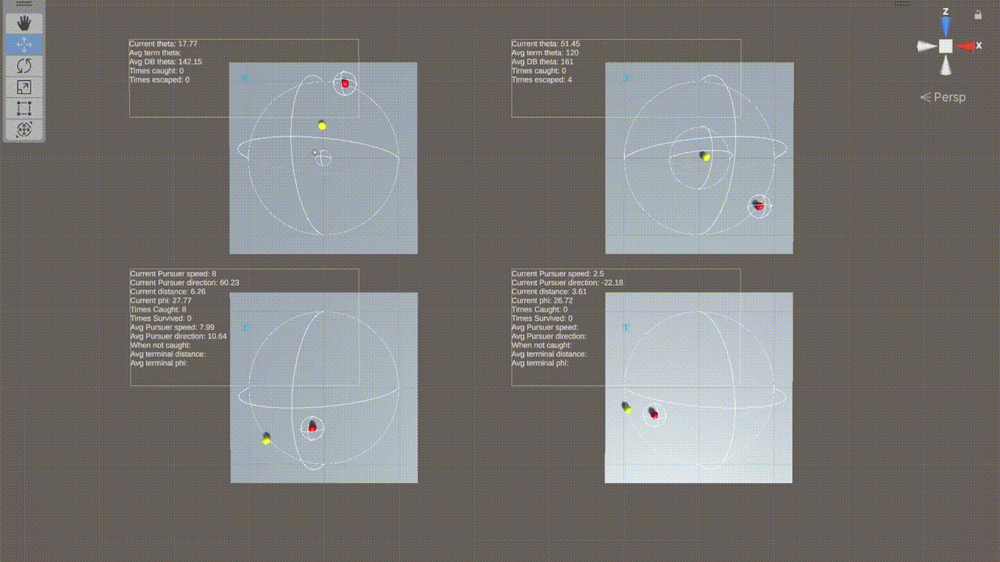

## Work Experience
- Research & Developer @ [Extropolis](https://extropolis.ai/){:target="_blank"} (2023 Jan - Current)
  - Develop backend for [ChatAF](https://extropolis.ai/chataf/){:target="_blank"}
    - [OpenAI](https://openai.com/){:target="_blank"} GPT-3.5/GPT-4 and LLM toolchain (e.g. [Langchain](https://docs.langchain.com/docs/){:target="_blank"}) prompting.
    - Develop function call plugins (web/news search, local search, long/short-term conversational memory, file processor, image generation) open-source [here](https://github.com/extropolis/ChatBE-plugins){:target="_blank"}.
    - [Railway](https://railway.app/){:target="_blank"} deployment for production/staging/development.
    - Server stress testing.
    - GitHub CI unit testing and deployment.
  - [Diffusitron](https://diffusitron.ai/){:target="_blank"}
    - Integrate Diffie AI using finetuned/prompt-based GPT in [Diffie Studio](https://app.diffusitron.ai/){:target="_blank"}.
    - Implement text streaming for chatting functionality, reducing the latency to $\sim$1s.
    - Implement/Improve various web frontend features with React.js based on designers' and users' feedbacks.
    - Load balancing using Cloudflare.
- Software Developer Intern @ [<i class="fa-brands fa-unity"></i> Unity Technologies](https://unity.com/){:target="_blank"} (2022 May - 2022 Aug)
  - Developed an interactivity AR project ([GUM](https://create.unity.com/gum){:target="_blank"}) in an agile team. Search #playwithgum for videos created by this app.
    - I mainly worked on tutorial features and body tracking service integration.
  - Participated as a release manager of a milestone build using UCB ([Unity gaming service](https://unity.com/solutions/gaming-services){:target="_blank"}). Configured production, staging and testing DNS routing using [Terraform](https://www.terraform.io/){:target="_blank"}.
  - Contributed to IET (In editor tutorial) that is used in Unity sample and learning (FPS/Karting/LEGO microgame). This IET template helps developers to get familiar with Unity engine and ~353k users used IET in H1 2022.
- Research Assistant @ [UBC BAR Lab](https://barlab.psych.ubc.ca/){:target="_blank"} (2021 May - 2022 Apr)
  - Developed Unity VR/WebXR projects for research in cognitive-behavioral testing.
- Software Developer @ [UBC EML](https://eml.ubc.ca/){:target="_blank"} (2018 Sep - 2020 Sep)
  - [Main Mall Hustle](https://eml.ubc.ca/projects/main-mall-hustle/){:target="_blank"}
  - [GeoVR](https://eml.ubc.ca/projects/geography-vr/){:target="_blank"}
  - [Interactive Orchestra](https://eml.ubc.ca/projects/interactive-orchestra/){:target="_blank"}

## Projects
- [Analysis and simulation of The Lady in the Lake problem](https://github.com/yuntaowu2000/RL-training){:target="_blank"}
  - Course Project for ECE1657 @ University of Toronto.
  - Simulated using Unity with [Unity ML](https://unity.com/products/machine-learning-agents){:target="_blank"}.

- [Trails - Game](https://trails-game.com/){:target="_blank"}
  - Chinese fan website for the game series: [The Legend of Heroes Kiseki Series/英雄伝説 軌跡シリーズ](https://www.falcom.co.jp/kiseki/){:target="_blank"}
  - Developed [Chinese version of 3D interactive world map](https://github.com/yuntaowu2000/TrailsMap){:target="_blank"} using Unity.
  - [Game World Rebuild](https://github.com/yuntaowu2000/KisekiWorldRebuild){:target="_blank"} using Unity.
  - Maintain and develop plugins for [story plot transcripts](https://book.trails-game.com/){:target="_blank"} using jQuery.
  - [Web Quiz](https://github.com/yuntaowu2000/trails-quiz){:target="_blank"}, [3D relation graph](https://github.com/trails-game/relation-graph-3d-force){:target="_blank"} and [LGC Calculator for Kuro no kiseki](https://github.com/yuntaowu2000/kuro-calculator){:target="_blank"} using Javascript, Node.js & Python.
  - [All other tools](https://github.com/yuntaowu2000/trails-games-tools){:target="_blank"} using Python.
 

<iframe center src="//player.bilibili.com/player.html?aid=985491660&bvid=BV12t4y1L7qX&cid=828676037&page=1" scrolling="no" frameborder="no" framespacing="0" allowfullscreen="true" width="100%" height="360px" style="display:block;"></iframe>

- [Quizzical](https://github.com/yuntaowu2000/CPEN321-Quizzical){:target="_blank"}
  - Course Project for CPEN321 @ University of British Columbia.
  - A platform for teachers to build quizzes for students and track student progress.
  - Frontend: Java.
  - Backend: Node.js, MongoDB.

## Misc

My [<i class="fa-brands fa-bilibili"></i> Bilibili](https://space.bilibili.com/392143020){:target="_blank"} includes some of the video demos for projects related to Trails-Game. (Chinese only)